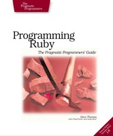
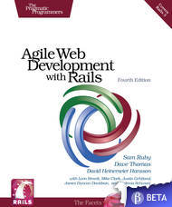

SLIDE!

# Books #

<table>
    <tr>
        <td>
            <h2>Programming Ruby: The Pragmatic Programmers' Guide, Second Edition</h2>
            
http://pragprog.com/titles/ruby/programming-ruby

        </td>
        <td>
            <h2>Agile Web Development with Rails (4th Edition)</h2>
            
http://pragprog.com/titles/rails4/agile-web-development-with-rails-4th-edition

        </td>
    </tr>
    <tr>
        <td>
            

        </td>
        <td>
            

        </td>
    </tr>
</table>

