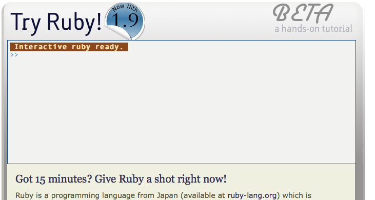

!SLIDE code
# Try It Out #

!SLIDE code
# TryRuby #

## http://tryruby.org ##
 

    

!SLIDE code
# IRB #
## (Interactive Ruby) ##

    @@@ ruby
    $ irb
    >> puts "Hello World"
    Hello World
    => nil
    >> 1+2
    => 3

!SLIDE code
# Script Files #

    * .rb extension
    * No required headers
    * run with `ruby filename.rb`
